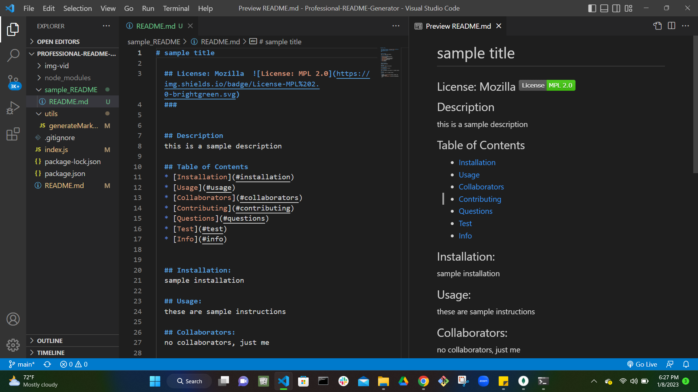
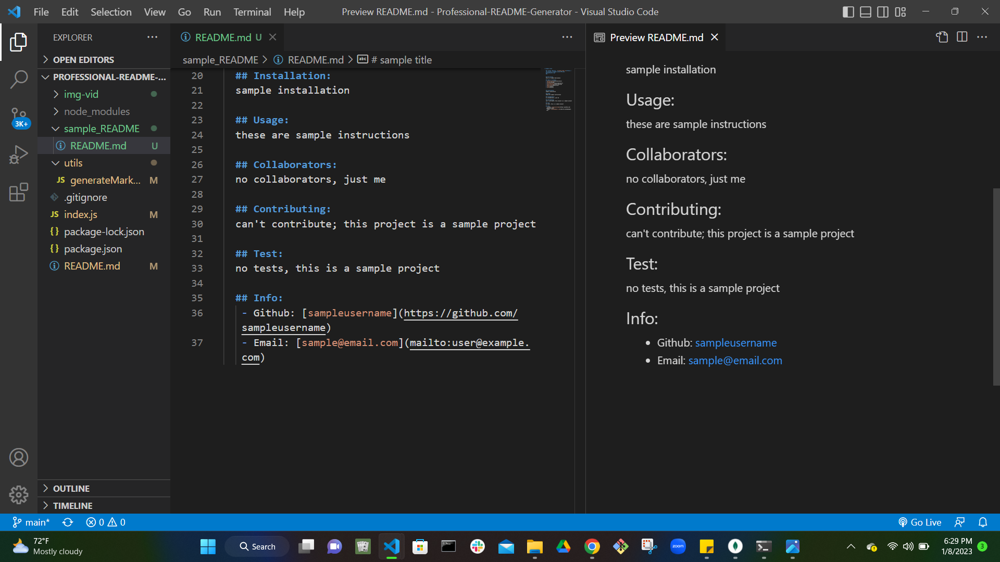

# Professional-README-Generator

## Description

This is a node application for creating a personalized README file that uses the user's input from generated prompts that correlate with specific sections in a pre-set "table of contents". The user is also given a list of licenses to choose from so that the README file will have it's respective license badge and link.

### Links

Video Link Showing Functionality is [here](./img-vid/README-Generator-vid.webm)
Link to Example README is [here](./sample_README/README.md)

#### Screenshots

